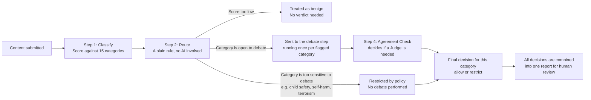
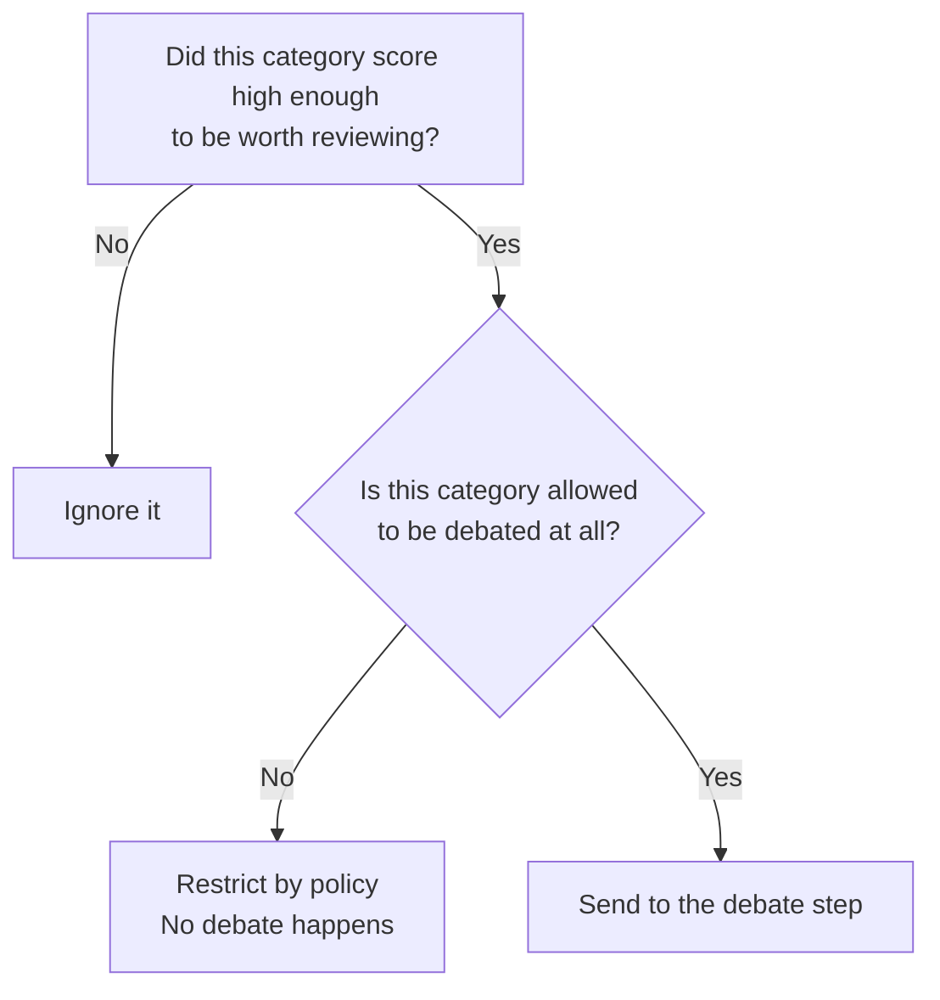
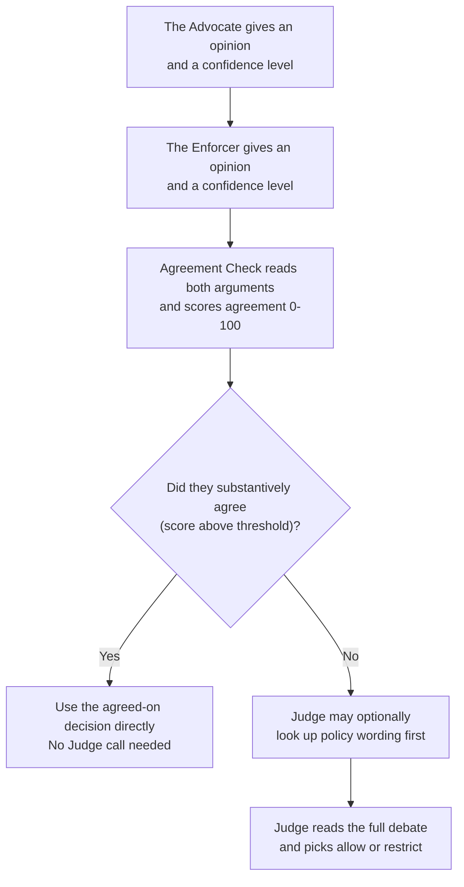
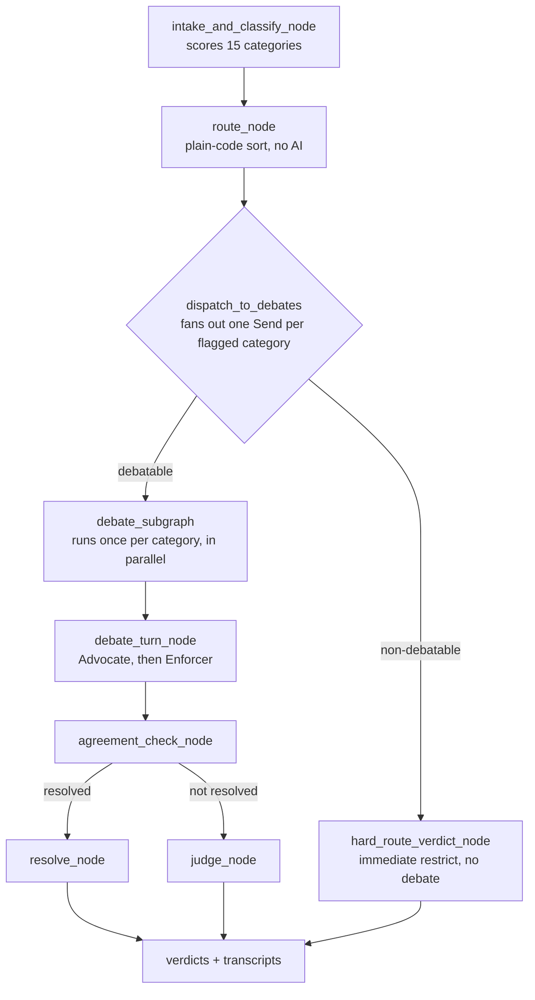

# ModAgent — How It Works (10 slides)

---

## Slide 1 — What problem are we solving?

Most automated content moderation tools force a single AI model to make a
yes-or-no call on a piece of content, and that single model is either too
strict (it blocks harmless content and frustrates users) or too lenient (it
misses real harm). ModAgent takes a different approach: for any borderline
case, it has two AI personas argue opposite sides of the question, and
checks how much they actually agree before settling on a final decision.

The system does four things, in order, for every piece of content:

1. It scores the content against fifteen policy categories (hate speech,
   harassment, violence, spam, and so on).
2. It decides, for each category that scored high enough, whether the
   category is even allowed to be debated, or whether it's too sensitive
   to leave to an AI argument at all.
3. For everything that can be debated, an Advocate (who leans toward
   allowing content) and an Enforcer (who leans toward restricting it)
   each give one opinion, and an Agreement Check measures how much they
   actually agree on the substance — not just whether they used the same
   word.
4. Only when they genuinely disagree does a Judge step in to read the full
   argument and pick whichever side it finds more convincing: allow or
   restrict. There's no third "ask a human first" option for the AI to
   reach for — every verdict is a real decision, and every verdict is
   handed to a human reviewer afterward regardless of what it says.

> **Speaker notes:** Open with the failure mode everyone in the room has
> seen: a single model gives you a confidence number, but confidence and
> correctness aren't the same thing — you can't tell a wrong 0.9 from a
> right 0.9. The pitch of this whole deck is "make disagreement do work
> for you instead of hiding it." Don't dive into mechanics yet; just land
> that the system structurally builds in two opposing opinions before it
> ever commits to a decision.

---

## Slide 2 — The path content takes through the system

Every category that is flagged runs through its own debate at the same
time as the others, rather than one after another. This is why the system
can review several categories in roughly the same amount of time it would
take to review one.

> **Speaker notes:** This is the 30-second version of the whole system —
> if someone only remembers one slide, it's this one. Walk left to right:
> classify once, then a cheap rule decides where each flagged category
> goes (benign / hard-restricted / debated), then debates run in
> parallel, not one after another. That parallelism point is worth
> pausing on — it's the difference between "reviewing 5 categories takes
> 5x as long" and "reviewing 5 categories takes about the same time as 1."

---

## Slide 3 — How content gets sorted before any debate happens

This sorting step is deliberately simple and predictable: it is plain
code, with no AI model involved, so its behavior can be tested and trusted
completely. It asks two questions about each category that scored high
enough to matter:

Some categories — currently child sexual abuse material, self-harm and
suicide content, and terrorism or extremism — are configured to never go
through debate, no matter what. This is a deliberate safety choice: the
worst categories should never depend on an AI argument resolving in time,
so they're restricted immediately and flagged for human review along
with everything else.

> **Speaker notes:** The key word here is "no AI involved." This step is
> just a lookup against a policy table plus two if-statements, which
> means it's 100% unit-testable and never hallucinates. If someone asks
> "what if the debate gets it wrong," the answer for the worst categories
> is: it never even gets a chance to — CSAE, self-harm, and terrorism
> never reach the debate step at all, by design, not by hoping the model
> behaves.

---

## Slide 4 — What happens inside a debate

Each side states its opinion as one of exactly two words — "allow" or
"restrict" — and gives a confidence level and a rationale. Both the
Advocate and Enforcer are told to find their own most-applicable rubric
clause rather than anchoring on whatever the other side already cited,
so the two opinions stay genuinely independent instead of one quietly
following the other's framing. The Agreement Check then reads both
rationales and scores how much they actually agree on the substance,
regardless of phrasing, and proposes the shared position when they do.
Most categories resolve in just two AI calls (Advocate, Enforcer) plus
one Agreement Check call — the Judge is only brought in for genuine,
unresolved disagreement, which keeps the system both faster and more
accurate.

Only the Judge can reach for a tool mid-argument — a lookup against the
real policy table (the full rubric and example cases for a category, or
a search for the most precise clause to cite) instead of relying on what
got paraphrased into a prompt. The Advocate and Enforcer already have the
rubric text in front of them for the category under debate, so they don't
need this round-trip; giving it to them as well would have doubled the
API calls spent on every single debate just to ask "do you want to look
something up?" on a question that's usually "no." The Judge is the one
role where that extra round-trip earns its cost, since it's only invoked
on the harder, genuinely unresolved cases to begin with. This is a local
lookup against the policy table already loaded in memory, not a network
call, so reaching for it doesn't add latency or extra cost risk when the
Judge does use it.

> **Speaker notes:** This slide has the one mechanical detail worth
> dwelling on: tool access used to be offered to all three roles, and we
> deliberately cut it back to just the Judge. The reasoning is pure cost:
> "may I use a tool?" is itself an extra LLM round-trip, and asking that
> question on every single Advocate/Enforcer turn doubled the API volume
> of the whole system for a "no" answer the vast majority of the time.
> The Judge keeps it because the Judge only fires on the hard, disputed
> cases, where verifying a clause is actually worth the call. Also call
> out the anti-anchoring instruction — without it, the second speaker
> tends to just rephrase the first speaker's cited clause, which looks
> like agreement but is really one side parroting the other.

---

## Slide 5 — What a finished result actually contains

For a single piece of content, the final result lists one outcome per
category that was flagged (not all fifteen categories, only the ones that
scored high enough to matter). For each flagged category, the result
includes:

- The final decision: allow or restrict.
- How confident the system was in that decision.
- The Advocate/Enforcer agreement score (0-100), so a reviewer can see at
  a glance whether the two sides were closely aligned or far apart.
- A plain-language explanation of why that decision was reached.
- The exact policy wording that the decision was based on.
- If a debate actually happened for that category, the Advocate's and
  Enforcer's opinions side by side, so a human reviewer can see exactly
  what each side argued.

Categories that were restricted by policy without a debate will not have
a back-and-forth to show — that is expected, not a missing piece of data.

> **Speaker notes:** This is the "what does the human reviewer actually
> see" slide. The point to land: nothing here is a black-box label. A
> reviewer can see the agreement score and decide for themselves whether
> a 62 vs. a 95 deserves a second look, even on categories the system
> already resolved without a Judge. If asked "isn't this a lot to show a
> reviewer," the answer is that transparency is the actual product here —
> a single label with no reasoning attached is exactly the thing this
> system exists to avoid producing.

---

## Slide 6 — Why this is different from a typical moderation pipeline

Most moderation tooling in production today is a single classifier (or a
single LLM call) that outputs one label per piece of content. That design
has a structural weakness: the model's confidence and its correctness are
two different things, and a single pass gives you no way to tell them
apart. A 0.91-confidence call that's wrong looks identical, from the
outside, to a 0.91-confidence call that's right.

ModAgent is built around a different idea: disagreement is itself a
useful signal, and it's cheap to manufacture on purpose. Concretely:

- **Two opposed personas instead of one judgment.** The Advocate and
  Enforcer are deliberately biased in opposite directions before they
  ever see the content — the Advocate defaults to allow with the burden
  of proof on the policy, the Enforcer defaults to restrict when in
  doubt. When two systems with opposite incentives still land on the
  same conclusion, that agreement is much stronger evidence than one
  model's confidence score. When they don't agree, that disagreement is
  flagged and routed to a third, independent call (the Judge) instead of
  being silently averaged away.
- **The Judge is conditional, not constant.** Most pipelines that try to
  add a second opinion just run every case through every stage,
  regardless of whether the first two stages already agreed. ModAgent
  only spends the extra Judge call on the categories that actually need
  it -- cases where the Advocate and Enforcer agreed don't pay for a
  third call at all, which keeps the system cheaper and faster on the
  (usually large) majority of clear-cut content, without giving up
  accuracy on the genuinely hard cases.
- **Agreement that's checked for being genuine, not just word-matching.**
  The Agreement Check is explicitly told that two sides citing the same
  clause in similar words isn't strong evidence of convergence by
  itself — it can just as easily mean one side anchored on the other's
  framing. It scores convergence down when the reasoning reads as a
  near-paraphrase, even if the position word matches, which is what
  actually justifies skipping the Judge.
- **Grounded lookups instead of paraphrase-and-hope.** A single-call
  classifier has to have the entire policy baked into its prompt or its
  training, and it can't check itself. Here, the Judge can reach for the
  real policy table at will, mid-argument, instead of relying on
  whatever got paraphrased into the system prompt -- closing off a common
  source of hallucinated or stale policy citations on exactly the cases
  where it matters most: the genuinely disputed ones.
- **Full transparency instead of a single opaque label.** Every output
  pairs the decision with the actual Advocate/Enforcer rationales, the
  agreement score, and the cited clauses -- so a human reviewer is looking
  at the reasoning, not just trusting a number.
- **No fake resolution.** Earlier moderation designs (including an
  earlier version of this one) lean on a third "escalate" outcome to
  paper over genuinely hard cases. ModAgent forces a real allow/restrict
  decision out of every case, and treats human review as a constant,
  blanket safety net rather than something the AI gets to invoke
  selectively -- so there's no case where the system's own uncertainty is
  hidden behind a vague "needs review" label.

> **Speaker notes:** This is the "why should anyone care" slide — good
> one to slow down on if the audience is technical leadership rather than
> engineers. The throughline across all five bullets is the same: every
> design choice here trades a little complexity for the ability to catch
> the system being wrong about itself. A single classifier has no way to
> notice its own overconfidence; this architecture is built specifically
> to surface that. If pressed on cost, the second and third bullets are
> the rebuttal — the expensive calls only happen on the cases that
> actually need them.

---

## Slide 7 — Why each prompt is written the way it is

The four prompts that drive the debate (Advocate, Enforcer, Judge, Agreement
Check) are deliberately narrow and specific rather than generic "you are a
content moderator" instructions, because each one is trying to prevent a
particular failure mode:

- **Shared confidence calibration, including gray areas.** All three
  debating roles (Advocate, Enforcer, Judge) share one instruction for
  what a confidence number means: above 0.85 only when the rubric's
  wording unambiguously settles the case, lower whenever the call
  depends on inferring intent or context. The instruction also calls out
  gray areas explicitly -- don't inflate confidence just because one
  outcome feels safer than the other. Without this, three
  independently-prompted roles tend to drift toward their own private
  notion of "confident," which makes their confidence numbers
  incomparable to each other -- and the Agreement Check and Judge both
  lean on comparing confidence across roles.
- **Advocate and Enforcer have opposite defaults, and find their own
  clause.** The Advocate's default is allow, with the burden of proof on
  the policy to clearly cover the content; the Enforcer's default is
  restrict when in doubt. Both are explicitly told to identify the
  rubric clause that's most applicable on their own, rather than
  anchoring on whichever clause the other side already cited or mirroring
  the other side's framing -- otherwise the second speaker tends to just
  rephrase the first one, which produces agreement that looks real but
  isn't.
- **The Judge is told what "strong" evidence actually means.** "Weigh the
  cited clauses" is meaningless without a definition of what makes one
  clause stronger than another; the Judge prompt defines it as
  specificity (a precise clause naming this exact harm beats a vague,
  general one) and tells the Judge to verify a clause itself with the
  lookup tool if it looks vague, missing, or possibly misremembered,
  rather than taking either side's citation on faith.
- **The Agreement Check is anchored against the trap that caused the
  original "always 100" symptom, and against anchored-not-independent
  agreement.** Earlier, the prompt only asked whether the two sides
  agreed on the position word, which let same-word pairs default to a
  100 score even when their confidence or reasoning diverged. The prompt
  now defines concrete score bands (90-100 requires matching position
  *and* similar rationale *and* close confidence; 60-89 covers
  same-position-different-reasoning; below 60 covers any real
  disagreement), explicitly instructs the model not to default to 100 on
  word-match alone, and caps the score at 75 whenever the two rationales
  read as nearly identical -- since matching reasoning that closely is a
  sign one side anchored on the other, not that two independent mandates
  genuinely converged.

The result is that all four prompts reinforce each other: the shared
confidence scale feeds the Agreement Check's confidence-delta band, the
opposite-default framing keeps the two sides' starting points genuinely
apart, and the anti-anchoring instruction in the Advocate/Enforcer prompts
is exactly what the Agreement Check's anchoring-penalty band is designed
to catch if it slips through anyway.

> **Speaker notes:** This slide rewards going slow if the audience asks
> "why not just write 'argue for both sides' and call it done." The
> answer is that vague prompts produce vague failure modes: without an
> explicit default-allow/default-restrict split the two sides converge
> on the same answer for the wrong reason (one copying the other), and
> without the anchoring penalty in the Agreement Check that copying gets
> rewarded with a perfect agreement score instead of caught. The "always
> 100" bug mentioned here was real — it's a good concrete example to cite
> if someone wants proof this isn't theoretical.

---

## Slide 8 — How the debate is actually wired together (the "agent")

There's no single monolithic agent loop here — the whole pipeline is one
LangGraph state machine, built from small, independently testable nodes:

A few wiring decisions worth calling out because they're easy to get wrong:

- **Each category's debate is its own subgraph instance**, dispatched via
  LangGraph's `Send` API rather than a loop. This is what lets every
  flagged category's Advocate/Enforcer/Agreement Check run concurrently
  instead of one after another — the parallelism is structural, not an
  afterthought bolted on with threads.
- **The subgraph only returns its fan-in keys (`verdicts`, `transcripts`)
  to the parent**, never the shared `content`/`api_key` channels. Parallel
  `Send` branches share those parent channels as plain last-value
  channels; returning them from every branch would collide and raise
  `INVALID_CONCURRENT_GRAPH_UPDATE`. This is enforced by
  `make_debate_subgraph_node()`, not by convention.
- **Routing decisions are plain Python, not graph nodes that call an
  LLM.** `route_node` and `agreement_routing_edge` are deterministic
  functions over already-computed scores — the only places an LLM gets
  invoked are `intake_and_classify_node`, `debate_turn_node`,
  `agreement_check_node`, and `judge_node`. Keeping routing logic out of
  the LLM-touching nodes is what makes the graph's control flow testable
  without mocking a model at all (see Slide 9's wiring tests).
- **Provider-level tool-call failures are retried, not fatal.** Even on
  calls where no tools were offered at all, a model occasionally
  hallucinates a tool call (e.g. trying to invoke `policy_lookup` from
  memory), which Groq rejects outright as a `tool_use_failed` error
  rather than returning a normal response. `debate_turn_node` and
  `judge_node` both retry that specific failure a couple of times before
  giving up, since it's a transient model hiccup, not a real problem with
  the request.

> **Speaker notes:** Good slide for an engineering-heavy audience. The
> `Send`-based fan-out is the one piece of LangGraph-specific knowledge
> worth explaining if anyone's unfamiliar with the library — the
> shorthand is "one subgraph instance per flagged category, running at
> the same time." The tool-call retry bullet is a good "we hit this in
> production and fixed it" anecdote: a model occasionally hallucinates a
> tool call on a request that never offered tools, Groq rejects the whole
> request, and naively that would crash a debate outright — so it gets
> retried as a transient hiccup instead.

---

## Slide 9 — How the test suite is organized

The tests split cleanly along the same boundary the graph itself uses —
deterministic logic vs. LLM-touching logic — so each layer can be tested
honestly, without pretending a mock proves an LLM call reasons correctly:

- **Unit tests** (`tests/unit/`) cover pure, deterministic logic with no
  network or mocking needed: `test_policy_loader.py` checks the policy
  table's structural invariants (every category has a row, every
  critical-severity category is non-debatable, no empty rubrics);
  `test_router.py` checks the plain-code sorting step from Slide 3 in
  isolation; `test_retry_policy.py` checks that the tool-use-failure
  retry from Slide 8 actually retries the right number of times and
  still raises once it's exhausted them.
- **Integration tests** (`tests/integration/`) cover the LLM-touching
  nodes, but with the LLM client itself stubbed out (`StubInstructorClient`,
  `StubRawClient`) so the test validates the *wiring* — does
  `check_agreement()` call the client and return its structured result
  unmodified? does `is_resolved()` correctly require both score and
  position? does the Judge's tool-calling round-trip degrade gracefully
  instead of crashing on a malformed tool call? — not the quality of any
  particular model's reasoning. `test_debate_graph.py` goes a step
  further and runs the whole compiled graph end-to-end with every LLM
  call monkeypatched, to prove the fan-out, conditional routing, and
  fan-in actually connect the way Slide 8's diagram claims they do.
- **The golden regression suite**
  (`tests/integration/test_golden_router_regression.py`) is different in
  kind: it replays every case in a public moderation-eval dataset
  (`tests/golden/moderation_cases.json`, imported via
  `tests/golden/import_openai_dataset.py`) through the real `route()`
  function, with classification scores derived directly from each case's
  known labels (1.0/0.0, no LLM call). This gives the routing step
  combinatorial coverage across real-world label combinations that would
  be impractical to hand-write, while still costing nothing and running
  in milliseconds.

The net effect: 225 tests currently pass, none of them require a live API
key, and a broken wiring change (e.g. a routing edge pointing at the wrong
node) fails loudly in CI before it ever reaches a real model call.

> **Speaker notes:** The framing to lead with: "we test the plumbing, not
> the model's opinions." Nobody can unit-test whether an LLM reasoned
> correctly about a specific piece of content, so the tests instead prove
> that if the LLM returns X, the system does the right thing with X every
> time — wiring, not judgment. The golden regression suite is worth a
> beat on its own: it's free (no LLM calls) and gives real-world coverage
> by replaying actual labeled cases through the deterministic router.

---

## Slide 10 — What's still worth improving

ModAgent today is a decision *layer*, not a full product: `run()` in
`backend/graph_runner.py` takes content and returns a verdict, with no UI
coupling -- but nothing currently calls out to act on that verdict, or to
keep the policy itself current. Closing the loop on both ends is the
highest-value next step:

- **A moderation-action API on the output side.** A verdict is only ever
  displayed right now -- nothing actually restricts the content once a
  human confirms it. Plugging into a real platform means calling that
  platform's own moderation/takedown API once a verdict is acted on (or,
  for very high-confidence cases, automatically).
- **A real policy source of truth on the input side.** `policy_table.yaml`
  is hand-maintained. In an actual Trust & Safety org, pulling the rubric
  from their policy CMS/API instead of a static file would keep every
  debate grounded in the *current* policy, not a snapshot someone forgot
  to update.
- **Enrichment APIs for evidence-light categories.** Categories like
  `pii_doxxing` or `spam_scam` are judged on text alone right now. A
  lookup against a known-spam list or a phone/address reverse-lookup API
  could give the Advocate and Enforcer real evidence to argue from,
  instead of judging plausibility from wording alone -- worth adding if a
  concrete failure case shows text-only judgment falling short, not
  preemptively.

> **Speaker notes:** Close on this as the honest "here's what's next,"
> not a sales pitch — it's a decision layer today, deliberately stopping
> short of taking action on its own verdicts. If asked "is this
> production ready," the honest answer is: the decision-making is solid
> and well-tested, but it has no hands yet — it doesn't act on what it
> decides, and it trusts a static policy file rather than a live policy
> source. Good place to end and open the floor for questions.
