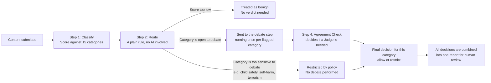
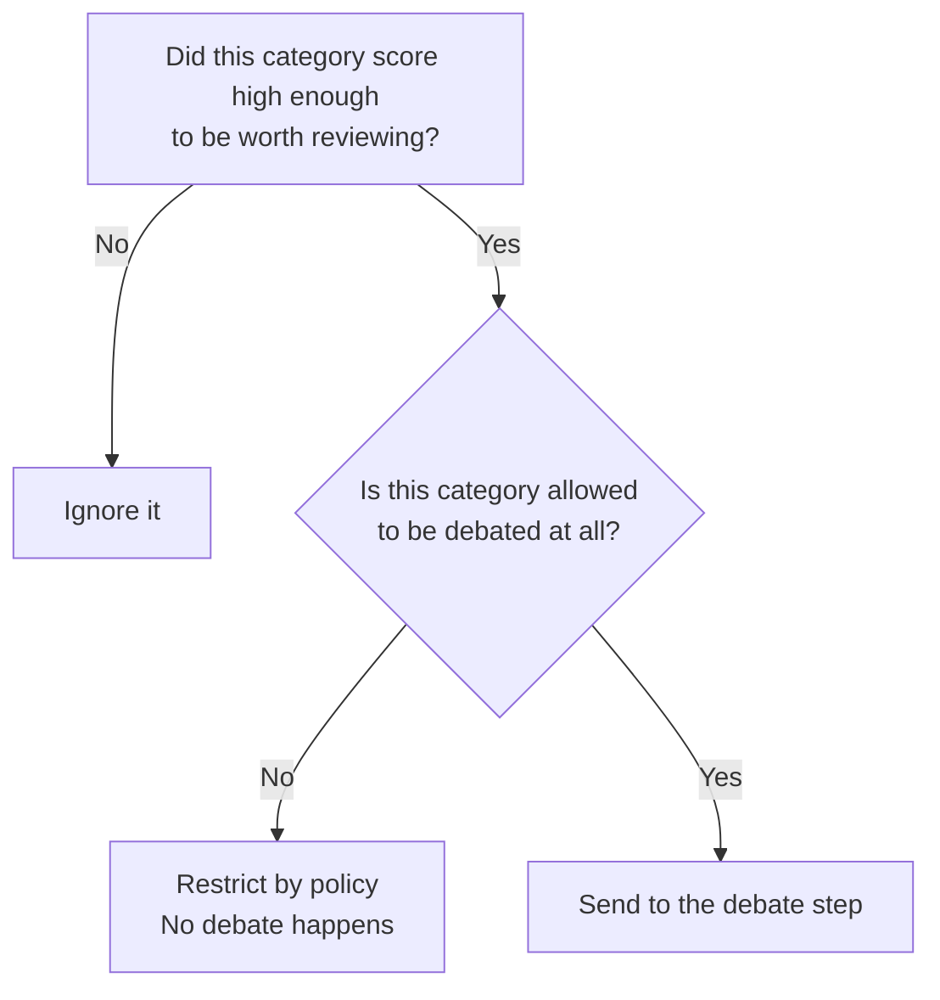
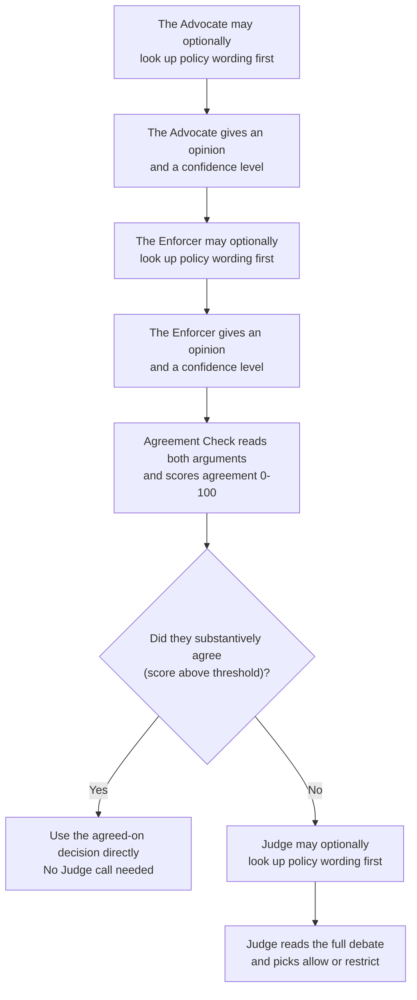

# ModAgent — How It Works (7 slides)

---

## Slide 1 — What problem are we solving?

Most automated content moderation tools force a single AI model to make a
yes-or-no call on a piece of content, and that single model is either too
strict (it blocks harmless content and frustrates users) or too lenient (it
misses real harm). ModAgent takes a different approach: for any borderline
case, it has two AI personas argue opposite sides of the question, and
checks how much they actually agree before settling on a final decision.

The system does four things, in order, for every piece of content:

1. It scores the content against fifteen policy categories (hate speech,
   harassment, violence, spam, and so on).
2. It decides, for each category that scored high enough, whether the
   category is even allowed to be debated, or whether it's too sensitive
   to leave to an AI argument at all.
3. For everything that can be debated, an Advocate (who leans toward
   allowing content) and an Enforcer (who leans toward restricting it)
   each give one opinion, and an Agreement Check measures how much they
   actually agree on the substance — not just whether they used the same
   word.
4. Only when they genuinely disagree does a Judge step in to read the full
   argument and pick whichever side it finds more convincing: allow or
   restrict. There's no third "ask a human first" option for the AI to
   reach for — every verdict is a real decision, and every verdict is
   handed to a human reviewer afterward regardless of what it says.

---

## Slide 2 — The path content takes through the system

Every category that is flagged runs through its own debate at the same
time as the others, rather than one after another. This is why the system
can review several categories in roughly the same amount of time it would
take to review one.

---

## Slide 3 — How content gets sorted before any debate happens

This sorting step is deliberately simple and predictable: it is plain
code, with no AI model involved, so its behavior can be tested and trusted
completely. It asks two questions about each category that scored high
enough to matter:

Some categories — currently child sexual abuse material, self-harm and
suicide content, and terrorism or extremism — are configured to never go
through debate, no matter what. This is a deliberate safety choice: the
worst categories should never depend on an AI argument resolving in time,
so they're restricted immediately and flagged for human review along
with everything else.

---

## Slide 4 — What happens inside a debate

Each side states its opinion as one of exactly two words — "allow" or
"restrict" — and gives a confidence level and a rationale. The Agreement
Check reads both rationales and scores how much they actually agree on
the substance, regardless of phrasing, and proposes the shared position
when they do. Most categories resolve in just two AI calls (Advocate,
Enforcer) plus one Agreement Check call — the Judge is only brought in
for genuine, unresolved disagreement, which keeps the system both faster
and more accurate.

Before committing to an opinion, the Advocate, Enforcer, and Judge can
each optionally call a tool to look up the real policy wording at
will — the full rubric and example cases for that category, or a search
for the most precise clause to cite — instead of relying on what was
paraphrased into the prompt. Nothing forces them to use it: each side
decides for itself, turn by turn, whether it actually needs to check
something before committing to an opinion, and most of the time it
won't. This is a local lookup against the policy table already loaded
in memory, not a network call, so reaching for it doesn't add latency or
extra cost risk even when a side does use it. The Agreement Check does
not get this tool, since its job is to compare the two rationales
already given, not to re-litigate policy wording.

---

## Slide 5 — There's no separate "needs human review" outcome

Earlier versions of this system had a third AI decision — "escalate" —
for cases where the Advocate and Enforcer couldn't agree, or agreed
something was severe. That turned out to be a confused design: an AI
escalating to a human is supposed to mean "we're not confident enough to
decide," but a 100/100 Agreement Check score paired with "escalate" was
the AI saying the *opposite* — "we're fully confident, and our shared
conclusion is to punt." Those two meanings don't belong in the same
field.

ModAgent now keeps the AI's job simple: every verdict is allow or
restrict, full stop. The Agreement Check resolves the case directly when
the two sides substantively agree (on either word); the Judge breaks the
tie with its own allow/restrict call when they don't. Either way, a real
decision comes out the other end.

Separately, and unconditionally: every decision — for every category, in
every piece of content — is shown to a human reviewer in the final
report, along with its confidence, its agreement score, and the full
debate transcript. Human review isn't something the AI decides to invoke
on hard cases; it's the standard, blanket practice for all output, so the
AI never has to carry the weight of deciding when a human is needed.

---

## Slide 6 — What a finished result actually contains

For a single piece of content, the final result lists one outcome per
category that was flagged (not all fifteen categories, only the ones that
scored high enough to matter). For each flagged category, the result
includes:

- The final decision: allow or restrict.
- How confident the system was in that decision.
- The Advocate/Enforcer agreement score (0-100), so a reviewer can see at
  a glance whether the two sides were closely aligned or far apart.
- A plain-language explanation of why that decision was reached.
- The exact policy wording that the decision was based on.
- If a debate actually happened for that category, the Advocate's and
  Enforcer's opinions side by side, so a human reviewer can see exactly
  what each side argued.

Categories that were restricted by policy without a debate will not have
a back-and-forth to show — that is expected, not a missing piece of data.

---

## Slide 7 — Why this is different from a typical moderation pipeline

Most moderation tooling in production today is a single classifier (or a
single LLM call) that outputs one label per piece of content. That design
has a structural weakness: the model's confidence and its correctness are
two different things, and a single pass gives you no way to tell them
apart. A 0.91-confidence call that's wrong looks identical, from the
outside, to a 0.91-confidence call that's right.

ModAgent is built around a different idea: disagreement is itself a
useful signal, and it's cheap to manufacture on purpose. Concretely:

- **Two opposed personas instead of one judgment.** The Advocate and
  Enforcer are deliberately biased in opposite directions before they
  ever see the content. When two systems with opposite incentives still
  land on the same conclusion, that agreement is much stronger evidence
  than one model's confidence score. When they don't agree, that
  disagreement is flagged and routed to a third, independent call (the
  Judge) instead of being silently averaged away.
- **The Judge is conditional, not constant.** Most pipelines that try to
  add a second opinion just run every case through every stage,
  regardless of whether the first two stages already agreed. ModAgent
  only spends the extra Judge call on the categories that actually need
  it -- cases where the Advocate and Enforcer agreed don't pay for a
  third call at all, which keeps the system cheaper and faster on the
  (usually large) majority of clear-cut content, without giving up
  accuracy on the genuinely hard cases.
- **Grounded lookups instead of paraphrase-and-hope.** A single-call
  classifier has to have the entire policy baked into its prompt or its
  training, and it can't check itself. Here, the Advocate, Enforcer, and
  Judge can each reach for the real policy table at will, mid-argument,
  instead of relying on whatever got paraphrased into the system prompt --
  closing off a common source of hallucinated or stale policy citations.
- **Full transparency instead of a single opaque label.** Every output
  pairs the decision with the actual Advocate/Enforcer rationales, the
  agreement score, and the cited clauses -- so a human reviewer is looking
  at the reasoning, not just trusting a number.
- **No fake resolution.** As covered in Slide 5, earlier moderation
  designs (including an earlier version of this one) lean on a
  third "escalate" outcome to paper over genuinely hard cases. ModAgent
  forces a real allow/restrict decision out of every case, and treats
  human review as a constant, blanket safety net rather than something
  the AI gets to invoke selectively -- so there's no case where the
  system's own uncertainty is hidden behind a vague "needs review" label.

---

## Slide 8 — Why each prompt is written the way it is

The four prompts that drive the debate (Advocate, Enforcer, Judge, Agreement
Check) are deliberately narrow and specific rather than generic "you are a
content moderator" instructions, because each one is trying to prevent a
particular failure mode:

- **Shared confidence calibration.** All three debating roles (Advocate,
  Enforcer, Judge) share one instruction for what a confidence number
  means: above 0.85 only when the rubric's wording unambiguously settles
  the case, lower whenever the call depends on inferring intent or
  context. Without this, three independently-prompted roles tend to drift
  toward their own private notion of "confident," which makes their
  confidence numbers incomparable to each other -- and the Agreement
  Check and Judge both lean on comparing confidence across roles.
- **Advocate and Enforcer are told to ground claims in the rubric, not
  vibes.** Both prompts now explicitly require rationale to trace back to
  the actual rubric language for that category, and to reach for the
  policy_lookup/clause_lookup tool when they're not sure the rubric
  covers the case -- rather than confidently asserting a policy basis
  that was never checked.
- **The Judge is told what "strong" evidence actually means.** "Weigh the
  cited clauses" is meaningless without a definition of what makes one
  clause stronger than another; the Judge prompt now defines it as
  specificity (a precise clause naming this exact harm beats a vague,
  general one) and tells the Judge to verify a clause itself with the
  lookup tool if it looks vague, missing, or possibly misremembered,
  rather than taking either side's citation on faith.
- **The Agreement Check is anchored against the trap that caused the
  original "always 100" symptom.** Earlier, the prompt only asked
  whether the two sides agreed on the position word, which let same-word
  pairs default to a 100 score even when their confidence or reasoning
  diverged. The prompt now defines concrete score bands (90-100 requires
  matching position *and* similar rationale *and* close confidence;
  60-89 covers same-position-different-reasoning; below 60 covers any
  real disagreement) and explicitly instructs the model not to default
  to 100 on word-match alone.

The result is that all four prompts reinforce each other: the shared
confidence scale feeds the Agreement Check's confidence-delta band, the
rubric-grounding instruction feeds the Judge's clause-specificity check,
and the tool-verification instruction is consistent across all three
roles that have tool access, instead of each prompt inventing its own
standard in isolation.

---

## Slide 9 — What's still worth improving

- The agreement-score threshold that decides "aligned enough to resolve
  automatically" was chosen as a reasonable starting point. It has not yet
  been tuned against real recorded debates, because we don't yet have a
  collected set of real debates to learn from.
- The dataset currently used to test the sorting step (Slide 3) only
  checks that categories get sorted correctly — it does not contain any
  example debates, so it cannot currently be used to judge whether the
  debate step itself is working well. Building a second dataset that
  includes example debates and their expected outcomes would close that
  gap.
- Right now, every flagged category's debate starts at the same time as
  every other one, which means a piece of content with many flagged
  categories sends a burst of AI calls all at once. Adding a cap on how
  many categories debate simultaneously (with the rest queued briefly)
  would smooth that out without changing the debate logic itself.
- The Streamlit app already shows one overall verdict for the whole piece
  of content (allowed or restricted) above the per-category breakdown, so
  a reviewer doesn't have to scan the full list just to tell whether
  anything was restricted.
