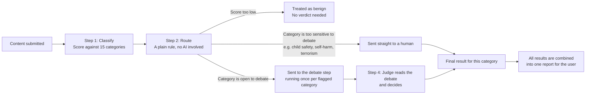
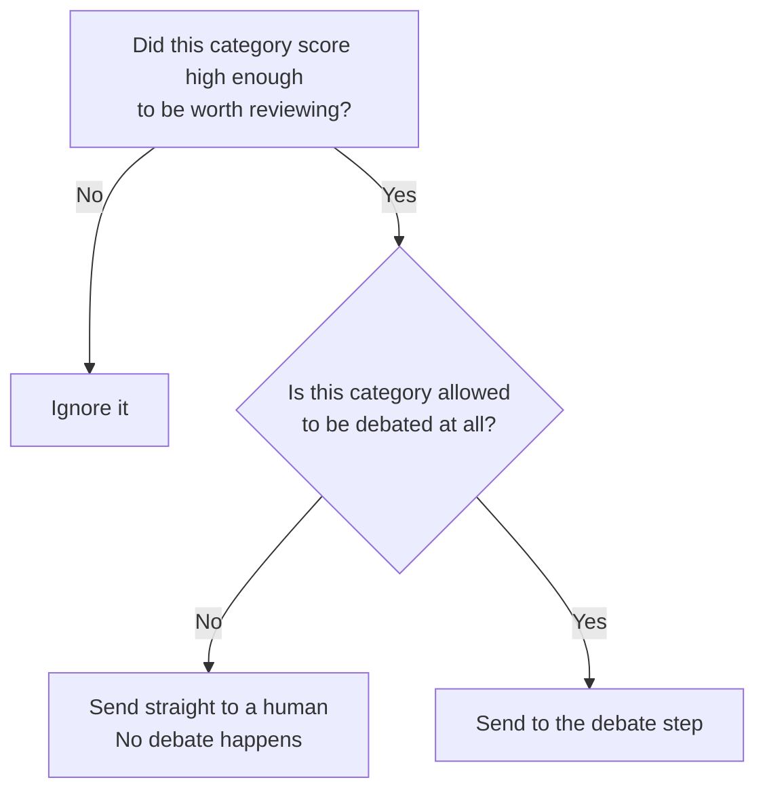
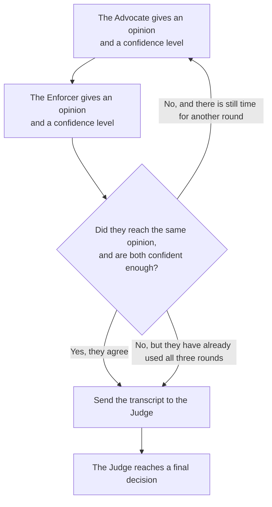

# ModAgent — How It Works (7 slides)

---

## Slide 1 — What problem are we solving?

Most automated content moderation tools force a single AI model to make a
yes-or-no call on a piece of content, and that single model is either too
strict (it blocks harmless content and frustrates users) or too lenient (it
misses real harm). ModAgent takes a different approach: for any borderline
case, it has two AI personas argue opposite sides of the question, and only
asks a human to step in when that argument genuinely cannot be settled.

The system does four things, in order, for every piece of content:

1. It scores the content against fifteen policy categories (hate speech,
   harassment, violence, spam, and so on).
2. It decides, for each category that scored high enough, whether the
   category is even allowed to be debated, or whether it must go straight
   to a human.
3. For everything that can be debated, it runs a structured back-and-forth
   between an Advocate (who leans toward allowing content) and an Enforcer
   (who leans toward restricting it).
4. A Judge reads that back-and-forth and reaches a final decision: allow,
   restrict, or escalate to a human.

---

## Slide 2 — The path content takes through the system

Every category that is flagged runs through its own debate at the same
time as the others, rather than one after another. This is why the system
can review several categories in roughly the same amount of time it would
take to review one.

---

## Slide 3 — How content gets sorted before any debate happens

This sorting step is deliberately simple and predictable: it is plain
code, with no AI model involved, so its behavior can be tested and trusted
completely. It asks two questions about each category that scored high
enough to matter:

Some categories — currently child sexual abuse material, self-harm and
suicide content, and terrorism or extremism — are configured to never go
through debate, no matter what. This is a deliberate safety choice: the
worst categories should never depend on an AI argument resolving in time;
they go to a human immediately.

---

## Slide 4 — What happens inside a debate

The Advocate is instructed to argue for giving the content the benefit of
the doubt, while still admitting when a violation is obvious. The Enforcer
is instructed to argue for caution, while still admitting when content is
clearly harmless. Each side must state its opinion as one of exactly three
words: "allow," "restrict," or "escalate," so that the two opinions can be
compared directly. Earlier in development, the two sides were allowed to
phrase their opinions in their own words, which meant their answers could
never really be compared to each other, and debates almost always looked
unresolved even when both sides actually agreed. That has since been
fixed.

---

## Slide 5 — Why a result sometimes says "needs human review"

A category is sent to a human, instead of being resolved automatically,
for one of four specific reasons, and the system now records which reason
applied so it can be shown to the user instead of one generic message:

1. **The category is never debated.** Some categories are too sensitive to
   leave to an AI argument, by policy, regardless of what either side
   would say.
2. **The two sides reached different opinions.** The Advocate and the
   Enforcer disagreed even after using all of their allowed rounds.
3. **The two sides agreed, but weren't confident enough.** Both said the
   same thing, but neither was confident enough in that answer for the
   system to trust it without a human checking.
4. **The Judge itself decided to escalate.** Even when the two sides agree
   confidently, the Judge — which separately reviews the full argument —
   can still decide that a human should make the final call.

Most categories are configured so that any unresolved disagreement
defaults to "send to a human" rather than "allow it anyway." This is a
deliberate, cautious default, not a flaw.

---

## Slide 6 — What a finished result actually contains

For a single piece of content, the final result lists one outcome per
category that was flagged (not all fifteen categories, only the ones that
scored high enough to matter). For each flagged category, the result
includes:

- The final decision: allow, restrict, or escalate.
- How confident the system was in that decision.
- A plain-language explanation of why that decision was reached.
- The exact policy wording that the decision was based on.
- If a debate actually happened for that category, the full back-and-forth
  between the Advocate and the Enforcer, so a human reviewer can see
  exactly how the disagreement unfolded.

Categories that went straight to a human, without a debate, will not have
a back-and-forth to show — that is expected, not a missing piece of data.

---

## Slide 7 — What's still worth improving

- The thresholds that decide how confident is "confident enough," and how
  many rounds of debate are allowed before giving up, were chosen as
  reasonable starting points. They have not yet been tuned against real
  recorded debates, because we don't yet have a collected set of real
  debates to learn from. A tool now exists to do that tuning properly once
  that data exists, rather than guessing at better numbers.
- The dataset currently used to test the sorting step (Slide 3) only
  checks that categories get sorted correctly — it does not contain any
  example debates, so it cannot currently be used to judge whether the
  debate step itself is working well. Building a second dataset that
  includes example debates and their expected outcomes would close that
  gap.
- The Streamlit app already shows one overall verdict for the whole piece
  of content (allowed, restricted, or needs human review) above the
  per-category breakdown, so a reviewer doesn't have to scan the full list
  just to tell whether anything needs attention.
