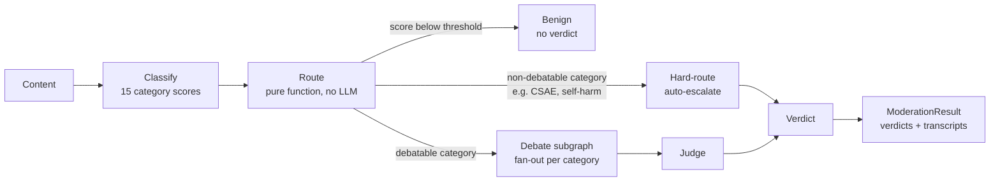
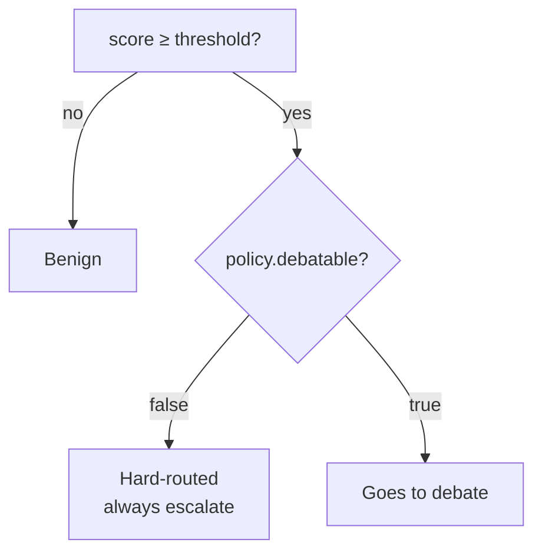
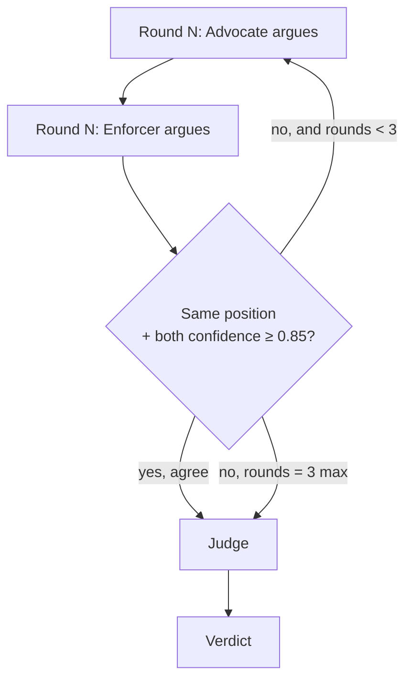

# ModAgent — How It Works (7 slides)

---

## Slide 1 — What problem is this solving?

Content moderation decisions are rarely black-and-white. A single "is this
allowed?" classifier either over-flags (kills engagement) or under-flags
(misses real harm). ModAgent's bet: **debate the borderline cases** with two
opposing LLM personas, and only escalate to a human when the debate
genuinely doesn't resolve.

- **Classifier**: scores content against 15 policy categories.
- **Router**: pure, deterministic, no LLM — decides per category whether it's
  *hard-routed* (always escalate, no debate), *debatable*, or *benign*.
- **Debate**: Advocate vs. Enforcer argue it out, per category, in parallel.
- **Judge**: reads the debate, returns allow / restrict / escalate.

---

## Slide 2 — End-to-end flow



Each category that clears the score threshold runs through its **own**
branch in parallel — LangGraph's `Send` API fans out one subgraph
invocation per category, all running concurrently, then fans the
results back in.

---

## Slide 3 — Classification & routing

The classifier is the only place an LLM scores raw content. It returns one
float (0–1) per category. The router is then **pure Python, zero
network calls** — fully unit-tested without ever touching an LLM:



Categories like `csae`, `self_harm_suicide`, `terrorism_extremism` are
**non-debatable by policy config** — they never reach an LLM debate at all,
by design (fail-closed for the worst-case categories).

---

## Slide 4 — The debate subgraph (per category)



- **Advocate**: free-expression-leaning — argues against over-moderation.
- **Enforcer**: risk-leaning — argues against under-moderation.
- Both must answer with `position` ∈ `{allow, restrict, escalate}` — a fixed
  vocabulary (this was a real bug we just fixed: free-text positions like
  *"Harmful But Contextual"* vs. *"hate speech and harassment"* could never
  match, so debates always looked unresolved).

---

## Slide 5 — Why "ESCALATE" shows up so often

The Judge is **fail-closed by construction** — it never needs to call an LLM
to decide to escalate:

1. **Non-debatable category** → always escalate, no LLM call.
2. **Unresolved disagreement + `escalate_on_tie: true`** → always escalate,
   no LLM call. ("Unresolved" = positions differ, or either side's
   confidence is below 0.85, even after 3 rounds.)
3. Otherwise → LLM Judge weighs both arguments and decides allow / restrict
   / escalate.

Most policy categories ship with `escalate_on_tie: true` — that's a
deliberate safety default, not a bug. The thing that *was* a bug: the
Advocate/Enforcer almost never could agree on `position` because they used
different free-text wording, so case 2 fired far more than it should have.
Fixed now by constraining `position` to `allow` / `restrict` / `escalate`.

---

## Slide 6 — What a result actually contains

```python
ModerationResult(
    verdicts=[Verdict(category, decision, confidence, rationale,
                       cited_clauses, escalated)],
    transcripts=[DebateTranscript(category, advocate_turns, enforcer_turns)],
)
```

- One `Verdict` per category that cleared the threshold (not all 15).
- A `DebateTranscript` only exists for categories that actually debated —
  hard-routed categories skip the debate entirely, so they have no
  transcript (this is expected, not a missing-data bug).

---

## Slide 7 — Where this can go next

- Tune `AGREEMENT_CONFIDENCE_THRESHOLD` / `MAX_ROUNDS` against the golden
  dataset now that `position` actually means something comparable.
- Surface *why* a category escalated (non-debatable vs. disagreement vs.
  low confidence) directly in the UI instead of one generic message.
- Add a single "Overall" banner (allow / needs review / restricted) instead
  of making the user scan a list to find the worst outcome.
