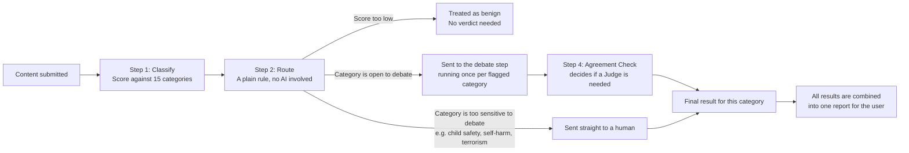
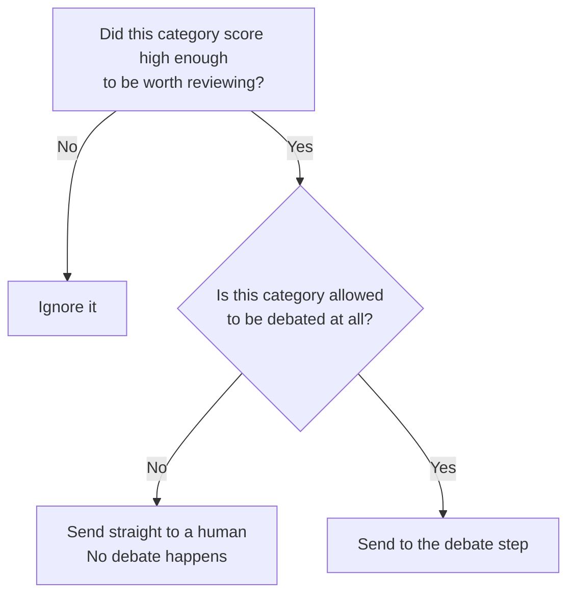
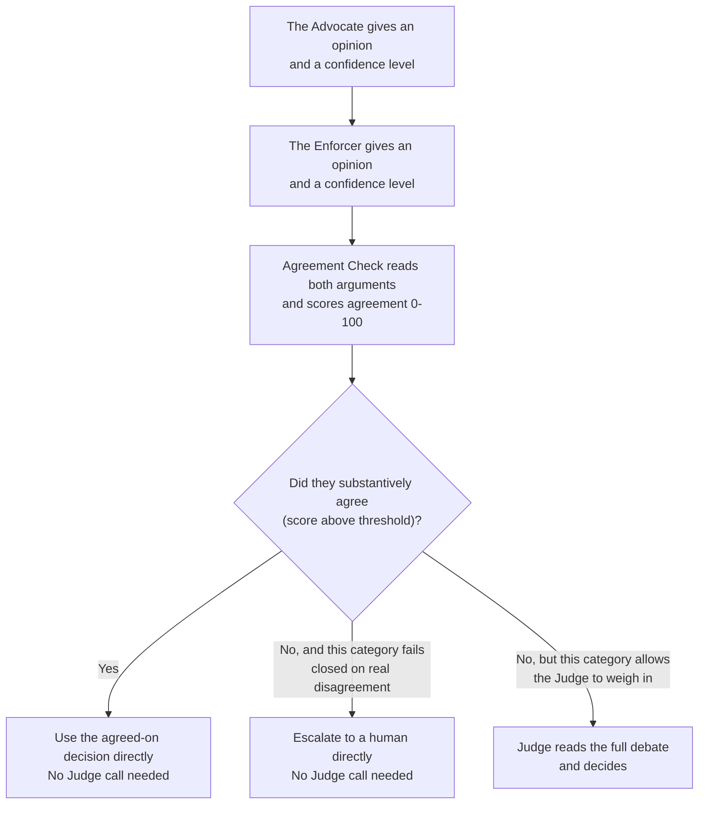

# ModAgent — How It Works (7 slides)

---

## Slide 1 — What problem are we solving?

Most automated content moderation tools force a single AI model to make a
yes-or-no call on a piece of content, and that single model is either too
strict (it blocks harmless content and frustrates users) or too lenient (it
misses real harm). ModAgent takes a different approach: for any borderline
case, it has two AI personas argue opposite sides of the question, checks
how much they actually agree, and only asks a human to step in when that
disagreement is genuine.

The system does four things, in order, for every piece of content:

1. It scores the content against fifteen policy categories (hate speech,
   harassment, violence, spam, and so on).
2. It decides, for each category that scored high enough, whether the
   category is even allowed to be debated, or whether it must go straight
   to a human.
3. For everything that can be debated, an Advocate (who leans toward
   allowing content) and an Enforcer (who leans toward restricting it)
   each give one opinion, and an Agreement Check measures how much they
   actually agree on the substance — not just whether they used the same
   word.
4. Only when they genuinely disagree does a Judge step in to read the full
   argument and reach a final decision: allow, restrict, or escalate to a
   human.

---

## Slide 2 — The path content takes through the system

Every category that is flagged runs through its own debate at the same
time as the others, rather than one after another. This is why the system
can review several categories in roughly the same amount of time it would
take to review one.

---

## Slide 3 — How content gets sorted before any debate happens

This sorting step is deliberately simple and predictable: it is plain
code, with no AI model involved, so its behavior can be tested and trusted
completely. It asks two questions about each category that scored high
enough to matter:

Some categories — currently child sexual abuse material, self-harm and
suicide content, and terrorism or extremism — are configured to never go
through debate, no matter what. This is a deliberate safety choice: the
worst categories should never depend on an AI argument resolving in time;
they go to a human immediately.

---

## Slide 4 — What happens inside a debate

Each side states its opinion as one of exactly three words — "allow,"
"restrict," or "escalate" — and gives a confidence level and a rationale.
Earlier in development, the system tried to detect agreement by checking
whether the two words matched exactly. That broke down in an important
way: the Advocate's lenient mandate caps out at "restrict" while the
Enforcer's cautious mandate reaches for "escalate" on anything severe, so
the two sides almost never used the literal same word even when they
clearly agreed something was wrong. The Agreement Check fixes this by
reading both rationales and scoring how much they actually agree on the
substance, regardless of which word each side used. Most categories now
resolve in just two AI calls (Advocate, Enforcer) plus one Agreement
Check call — the Judge is only brought in for genuine, unresolved
disagreement, which keeps the system both faster and more accurate.

Before committing to an opinion, the Advocate, Enforcer, and Judge can
each optionally look up the real policy wording — the full rubric and
example cases for that category, or a search for the most precise clause
to cite — instead of relying on what was paraphrased into the prompt.
This is a local lookup against the policy table already loaded in
memory, not a network call, so it doesn't add latency or extra cost risk;
it's only used when a side actually decides it needs to check something.
The Agreement Check does not use this lookup, since its job is to compare
the two rationales already given, not to re-litigate policy wording.

---

## Slide 5 — Why a result sometimes says "needs human review"

A category is sent to a human, instead of being resolved automatically,
for one of four specific reasons, and the system records which reason
applied so it can be shown to the user instead of one generic message:

1. **The category is never debated.** Some categories are too sensitive to
   leave to an AI argument, by policy, regardless of what either side
   would say.
2. **The two sides substantively agreed that escalation was warranted.**
   The Agreement Check found they were aligned, and what they were
   aligned on was "this needs a human."
3. **The two sides did not substantively agree, and this category fails
   closed on real disagreement.** Most categories are configured this way
   deliberately: an unresolved disagreement defaults to "send to a human"
   rather than "allow it anyway."
4. **The Judge itself decided to escalate.** For categories that allow a
   real disagreement to be weighed rather than failing closed
   automatically, the Judge reads both arguments and can still decide a
   human should make the final call.

---

## Slide 6 — What a finished result actually contains

For a single piece of content, the final result lists one outcome per
category that was flagged (not all fifteen categories, only the ones that
scored high enough to matter). For each flagged category, the result
includes:

- The final decision: allow, restrict, or escalate.
- How confident the system was in that decision.
- The Advocate/Enforcer agreement score (0-100), so a reviewer can see at
  a glance whether the two sides were closely aligned or far apart.
- A plain-language explanation of why that decision was reached.
- The exact policy wording that the decision was based on.
- If a debate actually happened for that category, the Advocate's and
  Enforcer's opinions side by side, so a human reviewer can see exactly
  what each side argued.

Categories that went straight to a human, without a debate, will not have
a back-and-forth to show — that is expected, not a missing piece of data.

---

## Slide 7 — What's still worth improving

- The agreement-score threshold that decides "aligned enough to resolve
  automatically" was chosen as a reasonable starting point. It has not yet
  been tuned against real recorded debates, because we don't yet have a
  collected set of real debates to learn from.
- The dataset currently used to test the sorting step (Slide 3) only
  checks that categories get sorted correctly — it does not contain any
  example debates, so it cannot currently be used to judge whether the
  debate step itself is working well. Building a second dataset that
  includes example debates and their expected outcomes would close that
  gap.
- Right now, every flagged category's debate starts at the same time as
  every other one, which means a piece of content with many flagged
  categories sends a burst of AI calls all at once. Adding a cap on how
  many categories debate simultaneously (with the rest queued briefly)
  would smooth that out without changing the debate logic itself.
- The Streamlit app already shows one overall verdict for the whole piece
  of content (allowed, restricted, or needs human review) above the
  per-category breakdown, so a reviewer doesn't have to scan the full list
  just to tell whether anything needs attention.
